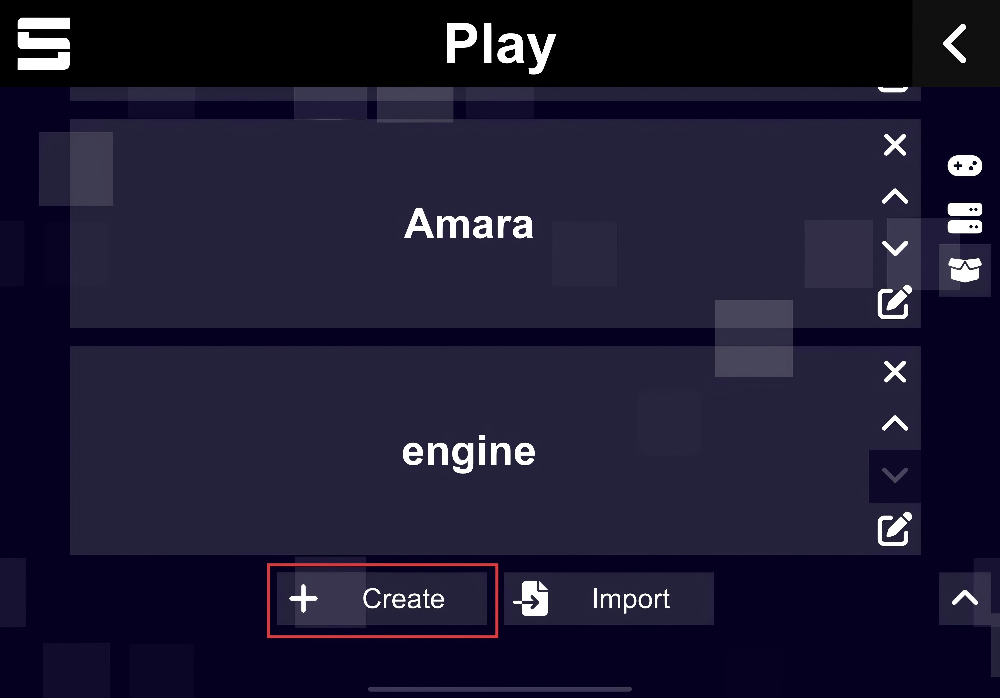
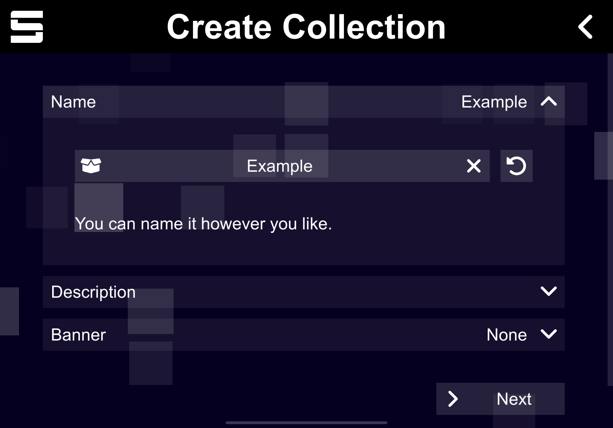
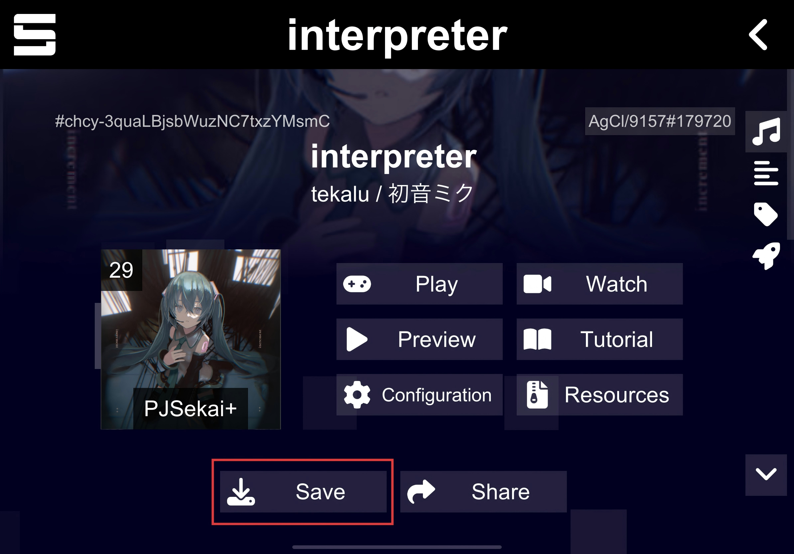
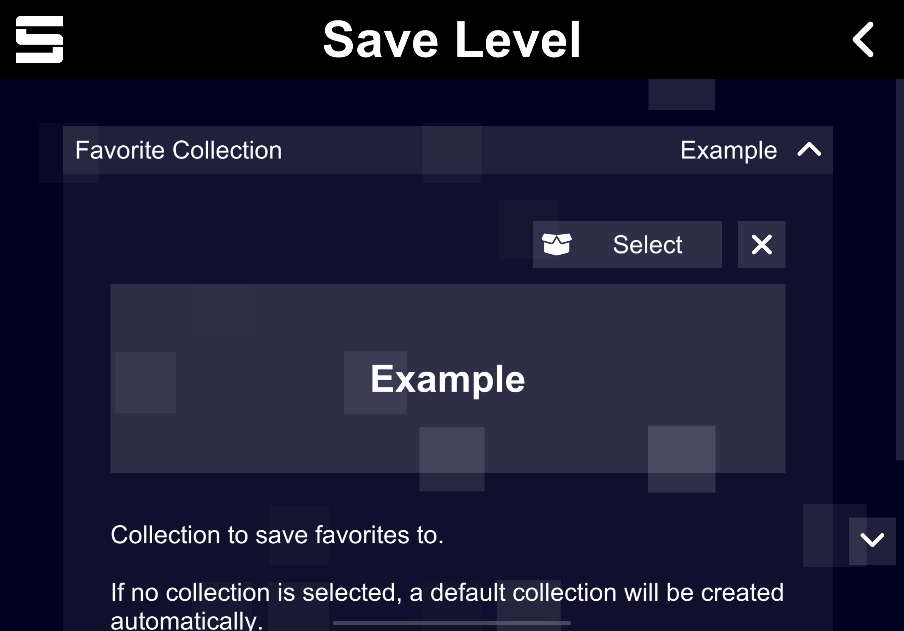
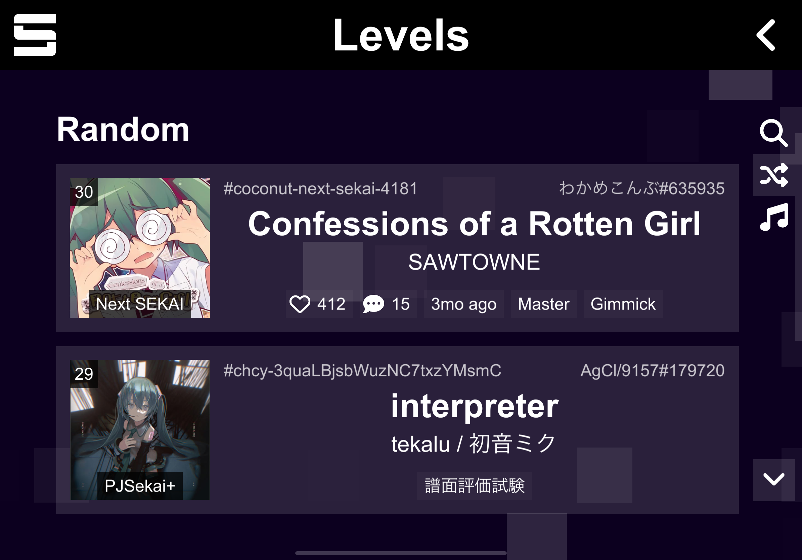
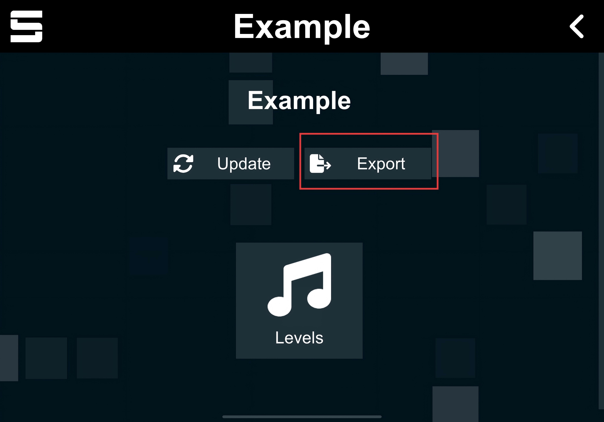
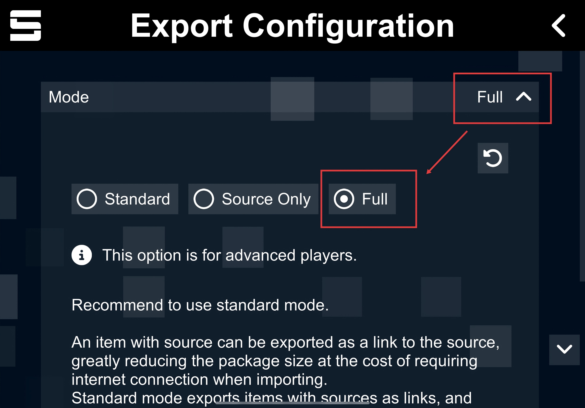

# Export a SCP pack from Sonolus

Use Sonolus collections to export one or more levels as a `.scp` pack.

> !IMPORTANT! Export Mode must be `FULL`.

## Steps

### 1. Create a collection

Select `Create` to create a new collection.

### 2. Name the collection

Enter a name for the collection.

### 3. Select a level

Choose the ProSeka level you want to export.

### 4. Add the level

Save the level to the collection you created.

### 5. Add more levels if needed

You can add multiple levels to the same collection before exporting.

For the web app, avoid exporting too many levels at once. Very large `.scp` packs may make the browser slow or unresponsive.

### 6. Export the collection

Select `Export` from the collection page.

### 7. Use full export mode

Set Export Mode to `FULL`, then export the `.scp` pack.

